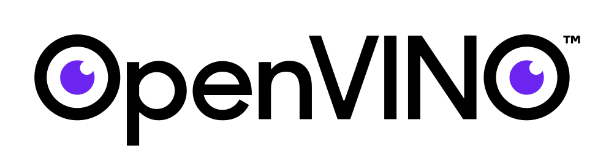

<div align="center">

 &nbsp;&nbsp;&nbsp;&nbsp; 

# n8n-nodes-openvino

**Agentic AI document workflows that run entirely on your Intel AI PC — CPU, GPU, or NPU. No cloud, no API keys, no data leaving your machine.**

Custom [n8n](https://n8n.io) nodes + a native [OpenVINO™](https://docs.openvino.ai) gateway that turn any PDF or image into structured, validated, searchable data — with an on-device AI agent doing the reasoning.

> **Google Summer of Code 2026** · **OpenVINO (Intel)**
> Contributor: Nand Kishore R · Mentors: Praveen Kundurthy & Max Domeika

</div>

---

## What it does — Smart Document Processing

Drop a document in a folder (or upload it), and it flows through a fully local pipeline:

```
File → dedup (sha256) → 🔍 CLIP triage (NPU) → OCR (VLM, GPU) → 🤖 Agent extract + validate → Postgres + Qdrant
                             │                                        │
                        not a document?                          enriched / flagged / duplicate
                             ↓                                        ↓
                     rejected/ (recoverable)                   processed/  •  searchable
```

- **CLIP triage on the NPU** — a real vision transformer decides *"is this a processable document?"* in ~20 ms before any heavy work; photos/selfies are rejected (recoverably), never silently dropped.
- **VLM OCR on the GPU** — Qwen2.5-VL reads layout, tables, and degraded scans near-perfectly; digital PDFs use the exact text layer.
- **On-device agent** — Qwen3-8B extracts a schema it picks per document type, then a deterministic validation layer checks the math (line-items → subtotal → tax → total, amount-in-words, coverage).
- **Stored + searchable** — queryable metadata in Postgres, embeddings in Qdrant, full audit trail.

Every model runs on **Intel silicon via OpenVINO** — the right chip for each job (NPU for the glance, GPU for accuracy).

---

## Prerequisites — install these first

You need **five** things on your machine before setup. Install them in this order:

| # | What | Why | How to get it |
|---|---|---|---|
| 1 | **Intel hardware** | runs the AI models | An **Intel AI PC** (Core Ultra — Lunar Lake / Meteor Lake) with GPU + NPU. *No AI PC? An Intel box with just a GPU still works (triage falls back to GPU). macOS/AMD = CPU-only, slow — not recommended.* |
| 2 | **Node.js 20+** | runs n8n + builds the nodes | [nodejs.org](https://nodejs.org) → download the LTS installer. Verify: `node -v` |
| 3 | **Python 3.10+** | runs the gateway | [python.org](https://python.org) → install, **tick "Add to PATH"**. Verify: `python --version` |
| 4 | **PostgreSQL** | stores document metadata | [postgresql.org/download](https://www.postgresql.org/download/) → install, **remember the password you set**. Verify: `psql --version` |
| 5 | **Qdrant** | stores search vectors | Download the binary from [github.com/qdrant/qdrant/releases](https://github.com/qdrant/qdrant/releases) — run it so it listens on port `6333`. |

> **Why run it "natively" (not in Docker)?** On **Windows**, Docker/Podman run inside a WSL2 Linux VM that **cannot reach the Intel NPU/GPU** — so the AI gateway runs directly on your OS. This native path works on **both Windows and Linux**. *(A container option for Linux-only users is in [Containers](#containers-linux-experimental).)*

---

## Setup

Seven steps. Each command is copy-paste ready — **only the parts in `<angle brackets>` need replacing.**

### Step 1 — Get the code and build the nodes
```bash
git clone https://github.com/Nandkishore-04/n8n-nodes-openvino
cd n8n-nodes-openvino
npm install && npm run build
```
This compiles the two custom n8n nodes into `dist/`. *(Takes a minute or two.)*

### Step 2 — Download the AI models
The gateway uses four models. Here's what each does:

| Model | Job (chip) | ~Size |
|---|---|---|
| **Qwen2.5-VL-7B** | reads the document — OCR (GPU) | ~6 GB |
| **Qwen3-8B** | the reasoning agent (GPU) | ~5 GB |
| **BGE** | search embeddings (CPU) | ~0.2 GB |
| **CLIP ViT-B/32** | the "is this a document?" glance (NPU) | built locally |

First install the Python libraries + the downloader:
```bash
pip install openvino-genai "optimum[openvino]" opencv-python pymupdf numpy torch transformers "huggingface_hub[cli]"
```
Then run these from the repo root — each drops the model into the folder the gateway expects:
```bash
# OCR model (GPU)
huggingface-cli download OpenVINO/Qwen2.5-VL-7B-Instruct-int4-ov --local-dir deployment/models/qwen2.5-vl-7b

# Agent LLM (GPU)
huggingface-cli download OpenVINO/Qwen3-8B-int4-ov --local-dir deployment/models/qwen3-8b-ov

# Triage model — built locally, not downloaded (creates deployment/models/clip/)
python scripts/convert_clip.py
```
*(BGE embeddings download automatically on first run — no command needed. Total download ≈ 11 GB, so use a good connection.)*

### Step 3 — Create the document folders
The pipeline moves files between five folders. Pick **one** parent folder (this is your **`docRoot`** — you'll need it again in Step 6):
```bash
# Linux / macOS
mkdir -p ~/proj-demo/{incoming,processing,processed,failed,rejected}
```
```powershell
# Windows (PowerShell)
mkdir C:\Users\<you>\proj-demo\incoming, C:\Users\<you>\proj-demo\processing, C:\Users\<you>\proj-demo\processed, C:\Users\<you>\proj-demo\failed, C:\Users\<you>\proj-demo\rejected
```

### Step 4 — Set up the databases
**Postgres** — create the tables (replace `<user>` and `<db>` with what you set during install, usually `postgres`/`postgres`):
```bash
psql -h localhost -U <user> -d <db> -f deployment/sql/init.sql
```
**Qdrant** — just start it; it listens on `6333` automatically:
```bash
./qdrant          # Linux/macOS
.\qdrant.exe      # Windows
```

### Step 5 — Start the AI gateway
This one process loads the models and talks to the chips. **Replace only the two `<...>` paths**, then run:
```bash
python scripts/native_gateway.py \
  --models deployment/models \
  --ocr-engine vlm --vlm-model deployment/models/qwen2.5-vl-7b \
  --llm deployment/models/qwen3-8b-ov \
  --ocr-device GPU --llm-device GPU --clip-device NPU \
  --port 8000
```
✅ **You're good when you see:** `Ready -> http://127.0.0.1:8000` and `CLIP document triage -> NPU`.

- **No NPU?** change `--clip-device NPU` → `--clip-device GPU`.
- **No GPU either?** use `--ocr-device CPU --llm-device CPU --clip-device CPU` (works, just slower).
- **Remote access?** it's local-only by default — add `--host 0.0.0.0 --api-key <your-secret>` only if you truly need it.

> Leave this terminal running. Open a **new** terminal for the next step.

### Step 6 — Start n8n
Set three environment variables, then launch n8n **in the same terminal window** (they must be set in the session that runs `n8n`). Replace `<repo>` with the full path to this folder and `<docRoot>` with your folder from Step 3:
```bash
# Linux / macOS
export N8N_CUSTOM_EXTENSIONS="<repo>/dist"
export NODE_FUNCTION_ALLOW_BUILTIN="fs,crypto"
export N8N_RESTRICT_FILE_ACCESS_TO="<docRoot>"
npx n8n
```
```powershell
# Windows (PowerShell)
$env:N8N_CUSTOM_EXTENSIONS="<repo>\dist"
$env:NODE_FUNCTION_ALLOW_BUILTIN="fs,crypto"
$env:N8N_RESTRICT_FILE_ACCESS_TO="C:/Users/<you>/proj-demo"
npx n8n
```
Open **http://localhost:5678** in your browser.

> ⚠️ On Windows these variables only apply to the **current** PowerShell window. If you close it, set them again before running `n8n`.

### Step 7 — Import and configure the workflow
Inside n8n (http://localhost:5678):
1. **Import** → select `workflows/smart-document-pipeline.json`
2. Open the **`Config`** node → set **`docRoot`** to your folder from Step 3. *(Leave `gatewayUrl` / `qdrantUrl` as-is unless you changed the ports.)*
3. Add the two **credentials** it asks for:
   - **Postgres** → the host/user/password you set in Step 4
   - **OpenVINO Model Server** → Gateway URL `http://127.0.0.1:8000`
4. Click **Active** (top-right) to turn the workflow on.

### ✅ Run it
Drop a PDF or image into the **`incoming/`** folder. Within seconds:
- a **real document** → read, extracted, validated → moves to `processed/` + rows appear in Postgres + vectors in Qdrant
- a **photo/selfie** → caught on the NPU glance → moves to `rejected/` (visible, recoverable — never deleted)
- a **duplicate** → skipped instantly at the hash check

---

## The custom nodes

- **OpenVINO Model Server** — `Classify Document` (CLIP triage on NPU), `Document Inference` (VLM OCR), `Embeddings`, `Chat Completion`, `Predict`, model status. Target device selectable (CPU/GPU/NPU/AUTO).
- **OpenVINO Agent** — a local ReAct loop over the document text with built-in tools (extract fields, validate totals, coverage check, flag for review, dedup, recall).

## Device layout (recommended)

| Stage | Chip | Why |
|---|---|---|
| Document triage (CLIP) | **NPU** | tiny, fast, the right chip for a cheap "glance" |
| OCR (Qwen2.5-VL) | **GPU** | accuracy on layout/tables/degraded scans |
| Agent (Qwen3-8B) | **GPU** | throughput for the reasoning loop |
| Embeddings (BGE) | CPU | light, runs anywhere |

## Containers (Linux, experimental)

A Podman stack (`deployment/podman-compose.yml` + `gateway.Dockerfile`) is provided for Linux users who prefer containers — Intel device passthrough works on native Linux. **It is not yet verified end-to-end** (native is the tested path); GPU is the default, NPU-in-container is best-effort. See the comments in `deployment/podman-compose.yml`.

## Development
```bash
npm run dev     # tsc --watch
npm test        # unit tests (Jest)
npm run lint    # eslint-plugin-n8n-nodes-base
```

## License
[Apache-2.0](LICENSE)
