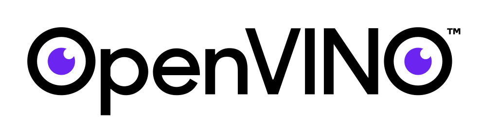
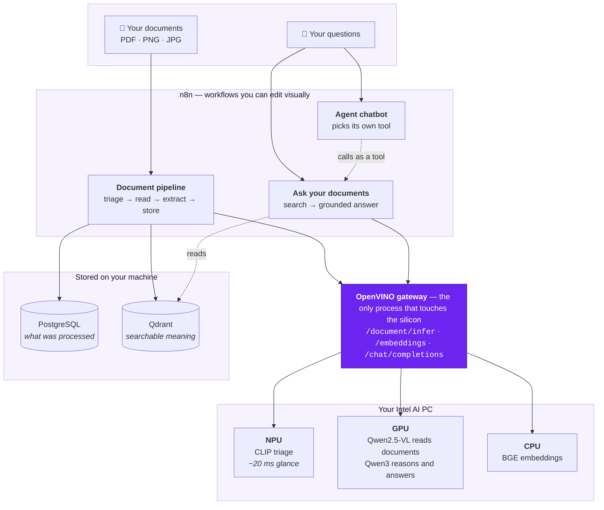

<div align="center">

 &nbsp;&nbsp;&nbsp;&nbsp; 

# n8n-nodes-openvino

**Drag-and-drop AI workflows that run entirely on your Intel AI PC — CPU, GPU and NPU. No cloud, no API keys, no data leaving your machine.**

Custom [n8n](https://n8n.io) nodes + a native [OpenVINO™](https://docs.openvino.ai) gateway that turn any PDF or image into structured, searchable data — then let you ask questions about it in plain English.

> **Google Summer of Code 2026** · **OpenVINO (Intel)**
> Contributor: Nand Kishore R · Mentors: Praveen Kundurthy & Max Domeika

</div>

---

## What you get

| | What it does |
|---|---|
| 📄 **Document pipeline** | Drop in a PDF or photo → it decides whether it's a real document, reads it, extracts the fields, validates them, and stores it — automatically. |
| 💬 **Ask your documents** | Ask a question in plain English. Answers are grounded in your documents only, and always cite the file they came from. |
| 🤖 **Agent chatbot** | A conversational layer that picks its own tool: search the documents, or query the database for counts and lists. |
| 🖥️ **Web dashboard** | Watch documents move through the pipeline live, and chat with them. Optional — everything works from n8n alone. |

**Everything runs on your machine.** The only network traffic is downloading the models, once.

---

## Hardware requirements

> [!IMPORTANT]
> This project targets **Intel** hardware. It will run on any x86 CPU, but the acceleration story needs an Intel GPU or NPU.

| | Minimum | Recommended |
|---|---|---|
| **CPU** | Any modern x86-64 | Intel® Core™ Ultra (Meteor Lake / Lunar Lake or newer) |
| **NPU** | not required | **Intel® AI Boost NPU** — runs the document triage |
| **GPU** | not required | **Intel® Arc™ / Iris® Xe integrated graphics** — runs the vision + language models |
| **RAM** | 16 GB | **32 GB** (all models resident at once) |
| **Disk** | 20 GB free | 30 GB free — the models are ~12 GB |
| **OS** | Windows 11 or Linux | Windows 11 (the tested path) |

**No Intel GPU or NPU?** Everything still works on CPU — just slower. Swap the device flags in [Step 5](#step-5--start-the-ai-gateway).

**macOS is out of scope** — there is no Intel NPU on Apple silicon.

---

## How it works

Only **one process** ever talks to the chips: the gateway. It holds every model in memory and exposes an OpenAI-compatible API, so the n8n nodes stay simple HTTP clients and a 7B model is never reloaded per request.


```mermaid
flowchart TB
    subgraph you[" "]
        direction LR
        DOC["📄 Your documents<br/>PDF · PNG · JPG"]
        Q["💬 Your questions"]
    end

    subgraph n8n["n8n — workflows you can edit visually"]
        direction LR
        WF1["<b>Document pipeline</b><br/>triage → read → extract → store"]
        WF2["<b>Ask your documents</b><br/>search → grounded answer"]
        AG["<b>Agent chatbot</b><br/>picks its own tool"]
    end

    GW["<b>OpenVINO gateway</b> — the only process that touches the silicon<br/><code>/document/infer</code> · <code>/embeddings</code> · <code>/chat/completions</code>"]

    subgraph chips["Your Intel AI PC"]
        direction LR
        NPU["<b>NPU</b><br/>CLIP triage<br/><i>~20 ms glance</i>"]
        GPU["<b>GPU</b><br/>Qwen2.5-VL reads documents<br/>Qwen3 reasons and answers"]
        CPU["<b>CPU</b><br/>BGE embeddings"]
    end

    subgraph store["Stored on your machine"]
        direction LR
        PG[("PostgreSQL<br/><i>what was processed</i>")]
        QD[("Qdrant<br/><i>searchable meaning</i>")]
    end

    DOC --> WF1
    Q --> WF2
    Q --> AG
    AG -.->|calls as a tool| WF2
    WF1 --> GW
    WF2 --> GW
    GW --> NPU & GPU & CPU
    WF1 --> PG & QD
    WF2 -.->|reads| QD

    classDef band fill:#f6f3fe,stroke:#c9b8f5,color:#1c1230
    classDef gw fill:#6c24f0,stroke:#4a17ab,color:#ffffff
    class n8n,chips,store,you band
    class GW gw
```

**In one sentence:** a document is glanced at by the NPU, read by the GPU, turned into searchable meaning by the CPU, and stored locally — then your questions search that store and are answered by the GPU, grounded only in what was found.

---

## Setup

Seven steps. Budget ~30 minutes, most of it model downloads.

### Prerequisites

Install these first — each links to its installer.

| | Version | Check it worked |
|---|---|---|
| [Node.js](https://nodejs.org) | 18 or newer | `node -v` |
| [Python](https://www.python.org/downloads/) | 3.10 or newer | `python --version` |
| [PostgreSQL](https://www.postgresql.org/download/) | 14 or newer | `psql --version` |
| [Qdrant](https://github.com/qdrant/qdrant/releases) | latest binary | `./qdrant --version` |
| [n8n](https://docs.n8n.io/hosting/installation/npm/) | latest | `npm i -g n8n` then `n8n --version` |

> [!TIP]
> On Windows, install PostgreSQL with the default `postgres` superuser and remember the password — you'll need it in Step 4.

### Step 1 — Get the code and build the nodes

```bash
git clone https://github.com/Nandkishore-04/n8n-nodes-openvino.git
cd n8n-nodes-openvino
npm install
npm run build          # compiles the custom nodes into dist/
pip install -r deployment/requirements.gateway.txt
```

✅ **Done when** `dist/` exists and `npm test` passes.

### Step 2 — Download the AI models

```bash
pip install huggingface-hub
huggingface-cli download OpenVINO/Qwen2.5-VL-7B-Instruct-int4-ov --local-dir deployment/models/qwen2.5-vl-7b
huggingface-cli download OpenVINO/Qwen3-8B-int4-ov            --local-dir deployment/models/qwen3-8b-ov
python scripts/convert_clip.py     # builds the NPU triage model locally
```

✅ **Done when** `deployment/models/` contains `qwen2.5-vl-7b/`, `qwen3-8b-ov/` and `clip/`.
⏱️ ~12 GB of downloads — this is the slow step.

### Step 3 — Create the document folders

This is where you drop files. Pick any path and remember it — it's your **docRoot**.

```bash
# Linux / macOS
mkdir -p ~/openvino-docs/{incoming,processing,processed,failed,rejected}

# Windows (PowerShell)
mkdir $HOME\openvino-docs\incoming, $HOME\openvino-docs\processing, `
      $HOME\openvino-docs\processed, $HOME\openvino-docs\failed, $HOME\openvino-docs\rejected
```

### Step 4 — Set up the databases

**PostgreSQL** — stores what was processed:
```bash
psql -h localhost -U postgres -d postgres -f deployment/sql/init.sql
```

**Qdrant** — start it, then create the collection:
```bash
./qdrant                            # Linux/macOS   (leave running)
.\qdrant.exe                        # Windows

python scripts/setup_qdrant.py      # in a new terminal
```

> [!WARNING]
> Don't skip `setup_qdrant.py`. Qdrant doesn't create collections on its own, and the word-matching half of search needs an index that this script builds. Without it the pipeline fails on the first document, and search quietly gets worse with no error message.

### Step 5 — Start the AI gateway

One process, loads the models, talks to the chips. **Leave this terminal running.**

```bash
python scripts/native_gateway.py \
  --models deployment/models \
  --ocr-engine vlm --vlm-model deployment/models/qwen2.5-vl-7b \
  --llm deployment/models/qwen3-8b-ov \
  --ocr-device GPU --llm-device GPU --clip-device NPU \
  --port 8000
```

✅ **Done when** you see `Ready -> http://127.0.0.1:8000` and `CLIP document triage -> NPU`.
⏱️ First start takes a minute or two while models compile for your hardware.

**Adjust for your machine:**

| Situation | Change |
|---|---|
| No NPU | `--clip-device GPU` |
| No Intel GPU either | `--ocr-device CPU --llm-device CPU --clip-device CPU` |
| Need remote access | add `--host 0.0.0.0 --api-key <your-secret>` (local-only by default) |

### Step 6 — Start n8n

Set three variables and start n8n **in the same terminal window** — they must be set in the session that runs it.

```bash
# Linux / macOS
export N8N_CUSTOM_EXTENSIONS=$(pwd)/dist
export NODE_FUNCTION_ALLOW_BUILTIN=fs,crypto
export N8N_RESTRICT_FILE_ACCESS_TO=$HOME/openvino-docs
n8n start
```
```powershell
# Windows (PowerShell)
$env:N8N_CUSTOM_EXTENSIONS="<full-path-to-repo>\dist"
$env:NODE_FUNCTION_ALLOW_BUILTIN="fs,crypto"
$env:N8N_RESTRICT_FILE_ACCESS_TO="$HOME\openvino-docs"
n8n start
```

✅ **Done when** http://localhost:5678 opens and searching for "OpenVINO" in the node panel shows your custom nodes.

> [!TIP]
> Seeing `Unrecognized node type: CUSTOM.openVinoModelServer`? `N8N_CUSTOM_EXTENSIONS` didn't reach n8n — set it and start n8n in the *same* window, and use `n8n start` rather than `npx n8n`.

### Step 7 — Import the workflows

In n8n: **Workflows → Import from File**, then repeat for each:

| File | What it is | Activate? |
|---|---|---|
| `workflows/smart-document-pipeline.json` | the document pipeline | ✅ yes |
| `workflows/rag-qa.json` | ask your documents | ✅ yes |
| `workflows/query-records.json` | database tool for the agent | ⬜ no (called as a tool) |
| `workflows/agent-chatbot.json` | conversational agent that picks its own tool | ✅ yes |

Then, **once per workflow**:

1. **Credentials** — open any red-flagged node and create/select:
   - **OpenVINO Model Server** → Gateway URL `http://127.0.0.1:8000`
   - **Postgres** → your database, user and password from Step 4
2. **Config node** — open the `Config` node in each workflow and set `docRoot` to your folder from Step 3. Everything else can stay as-is.
3. **Agent chatbot only** — its three tool nodes point at workflow IDs from another machine, so open each `Call '...'` node and re-select the workflow from the dropdown. Also select your OpenAI-compatible credential on the `OpenAI Chat Model` node, with the base URL set to `http://127.0.0.1:8000/v1`.

---

## ✅ Run it

1. Drop a PDF or photo into `<docRoot>/incoming/`
2. Watch it move: `incoming → processing → processed`
3. In n8n, open **RAG Q&A (WF2)** and run it with a question, or use the webhook:

```bash
curl -X POST http://localhost:5678/webhook/rag-query \
  -H 'content-type: application/json' \
  -d '{"query":"what was the total on the invoice?"}'
```

You should get a grounded answer plus the source file it came from.

---

## Optional — the web dashboard

A local dashboard for uploading documents and chatting with them.

```bash
cd web
npm install
cp .env.local.example .env.local     # then edit it
npm run dev                          # http://localhost:3000
```

Set two things in `.env.local`:
- `WATCH_DIR` — **exactly** the docRoot from Step 3
- `PGUSER` / `PGPASSWORD` — your PostgreSQL login

> [!TIP]
> The **Home** page has a connection panel that checks every link — folders, database, gateway, workflows — and tells you the exact fix for anything that's broken. Start there if something doesn't work.

---

## The custom nodes

**OpenVINO Model Server** — one node, several operations:

| Operation | What it does |
|---|---|
| Classify Document | zero-shot triage — is this a processable document? |
| Document Inference | PDF/image → text (text layer for digital PDFs, VLM OCR for scans) |
| Embeddings | text → 768-dim vector for search |
| Chat Completion | prompt → answer |
| Transcribe / Speak | speech ↔ text (optional; needs `--asr-model` / `--tts-model`) |
| Predict · List Models · Get Status | classic model serving |

**OpenVINO Agent** — a reasoning loop with built-in tools for extraction, validation and duplicate checking.

Every operation has a **Target Device** dropdown: `CPU`, `GPU`, `NPU` or `AUTO`.

---

## Device layout

What runs where by default, and why:

| Model | Job | Device | Why there |
|---|---|---|---|
| CLIP ViT-B/32 | is this a document? | **NPU** | tiny, constant-shape, ~20 ms — perfect NPU work |
| Qwen2.5-VL-7B | read the document | **GPU** | large vision model, needs the throughput |
| Qwen3-8B | reason and answer | **GPU** | same |
| BGE-base-en-v1.5 | search embeddings | **CPU** | small and frequent; keeps the GPU free |

---

## Troubleshooting

| Symptom | Cause and fix |
|---|---|
| `Unrecognized node type: CUSTOM.openVinoModelServer` | `N8N_CUSTOM_EXTENSIONS` not set in the terminal running n8n — see Step 6 |
| Documents stay in `incoming/` | the pipeline workflow isn't **Active**, or `docRoot` doesn't match your folder |
| First document fails at the storage step | `setup_qdrant.py` wasn't run — see Step 4 |
| Search misses exact IDs like `INV-2024-0891` | the full-text index is missing — re-run `setup_qdrant.py` |
| `CLIP triage failed on NPU` | your machine has no NPU — use `--clip-device GPU`; the pipeline still works |
| Answers say "no documents stored yet" | nothing has been processed yet, or Qdrant was cleared |
| Everything is slow on the first run | models compile for your hardware once — later runs are much faster |

---

## Containers (Linux, experimental)

A Podman stack (`deployment/podman-compose.yml` + `gateway.Dockerfile`) is provided for Linux users who prefer containers, where Intel device passthrough works.

> [!WARNING]
> **Not verified end-to-end**, and **not usable on Windows** — Windows containers run inside a WSL2 VM that cannot reach the NPU. Native is the tested path on both Windows and Linux.

---

## Development

```bash
npm run dev     # tsc --watch
npm test        # unit tests (Jest)
npm run lint    # eslint-plugin-n8n-nodes-base
```

## License
[Apache-2.0](LICENSE)
